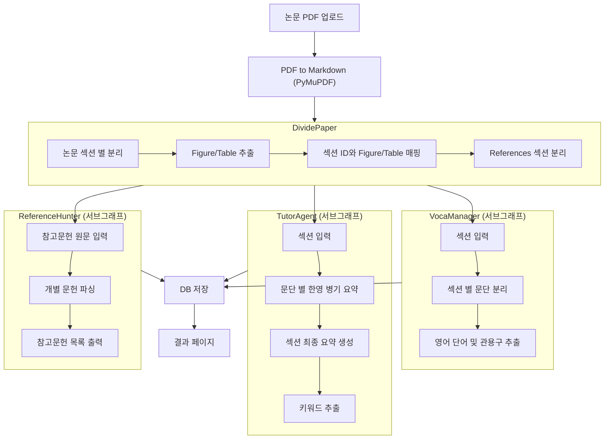

# 슬기로운 대학원 생활

## 1. 에이전트 이름

슬기로운 대학원 생활 (논문 읽기 어시스턴트)

## 2. 에이전트 목적

영어를 못하는 상황에서 해외 논문을 읽는건 정말 어려웠다. 그렇다고 번역기만 돌리자니 대학원을 다니고 있는 학생이 맞는건가 싶은 괴리감이 들었다. 어차피 논문을 쓰려면 AI를 사용하더라도 내용을 직접 검수해야하고, 그러려면 영어 능력은 필수적으로 높여야 한다. 다만, 논문을 읽다보면 참고 문헌의 어떤 부분을 참고 했는지 보고 싶어도 찾는데 시간이 꽤 걸리고, 어려운 영어 어휘나 표현이 나오면 그걸 찾다가 논문을 읽기 싫어지기도 한다. 그래서 한 번에 논문을 읽으면서 개인 역량도 키울 수 있는 에이전트가 있으면 좋겠다고 생각했다.

## 3. 기술 스택

| 구분            | 기술                                   |
| --------------- | -------------------------------------- |
| 워크플로우 엔진 | LangGraph (Send API 병렬 처리)         |
| LLM             | OpenAI GPT-4o-mini (Structured Output) |
| PDF 파싱        | PyMuPDF                                |
| UI              | Streamlit (wide layout)                |
| DB              | SQLite                                 |
| 패키지 관리     | uv                                     |

## 4. 시스템 아키텍처



### LangGraph 그래프 구조

```
START → convert_and_divide → route_to_subgraphs (Send API 병렬):
  ├─ [섹션별] run_voca_manager    ─┐
  │    └─ split_paragraphs         │
  │       → extract_words          │
  ├─ [섹션별] run_tutor_agent     ─┤→ save_results → END
  │    └─ split_paragraphs         │
  │       → summarize_paragraphs   │
  │       → generate_section_summary│
  └─ [참고문헌] run_reference_hunter─┘
       └─ parse_references
```

- 각 Agent는 독립된 **compiled subgraph**로 분리
- Send API로 섹션별 병렬 fan-out, Annotated reducer로 fan-in

## 5. 핵심 기능

### PDF 파싱 (PyMuPDF)

- PDF를 Markdown으로 변환 (폰트 크기 기반 heading 추정)
- heading 기준 섹션 분리
- Figure 이미지 추출
- 참고문헌 섹션 별도 분리
- 논문 초반 저자/기관/메타 정보 자동 필터링

> **PDF 파서 변경 이력**
>
> | 파서 | 시도 결과 |
> |------|----------|
> | Docling (IBM) | 레이아웃 분석 우수하나, Streamlit Cloud에서 HuggingFace 모델 다운로드 실패 (`LocalEntryNotFoundError`) |
> | marker-pdf | 변환 품질 좋으나, 1.35GB AI 모델 로딩으로 Streamlit Cloud 무료 티어(RAM 1GB)에서 메모리 부족 |
> | **PyMuPDF** | AI 모델 없이 순수 C 라이브러리로 동작. 경량 + 빠름. Streamlit Cloud 호환. heading 추정은 폰트 크기 기반으로 제한적이지만 실용적 |

### VocaManager (단어장)

- 섹션별 문단 분리 후 단어/관용구 추출
- 관용구(collocation, phrasal verb, idiom) 자동 태깅
- 한국어 뜻 + 영어 정의 + 원문 문장 포함
- Pydantic Structured Output으로 일관된 형식 보장

### TutorAgent (섹션 요약)

- 문단별 한영 병기 요약
- 문단 요약을 종합한 섹션 최종 요약 (한영 병기)
- 핵심 학술 키워드 5~10개 추출

### ReferenceHunter (참고문헌)

- References 원문에서 개별 문헌 파싱
- 번호 패턴 자동 감지 (`[1]`, `1.`, `- [1]` 등)

## 6. UI 구조

### 업로드 페이지

- PDF 업로드 후 업로드 필드 자동 숨김
- 파싱 진행 상황 표시
- 3컬럼 실시간 진행 (VocaManager / TutorAgent / ReferenceHunter)
- 이전에 분석한 논문 목록 표시 → 클릭 시 DB에서 로드하여 바로 결과 페이지로 이동

### 결과 페이지 (섹션별 카드 네비게이션)

```
┌───────────────────────────────────────────────┐
│           논문 제목 (중앙 상단)                  │
│  ◀ 이전 | ▶ 다음 | 섹션 3/16 | [드롭다운] | 새논문 │
├───────────────────────┬───────────────────────┤
│                       │ 📋 요약                │
│  섹션 원문 (Markdown)  │  한영 병기 요약          │
│  Figure/수식 위치 표시  │  키워드                 │
│                       ├───────────────────────┤
│                       │ 📝 단어장               │
│                       │  단어/관용구 목록         │
│                       │  한국어 뜻 + 영어 정의    │
└───────────────────────┴───────────────────────┘
```

- 이전/다음 버튼 + 드롭다운으로 섹션 이동
- 마지막 페이지: 참고문헌 목록

## 7. DB 스키마

| 테이블              | 주요 컬럼                                                                                    |
| ------------------- | -------------------------------------------------------------------------------------------- |
| `papers`            | id, title, file_path                                                                         |
| `sections`          | paper_id, section_index, heading, content                                                    |
| `vocabulary`        | paper_id, section_index, word, is_idiom, context_sentence, meaning_ko, meaning_en            |
| `figures_tables`    | paper_id, section_index, item_type, label, caption, image_path, table_markdown               |
| `section_summaries` | paper_id, section_index, heading, paragraph_summaries(JSON), section_summary, keywords(JSON) |
| `reference_links`   | paper_id, ref_index, title                                                                   |

## 8. 프로젝트 구조

```
wise-graduate-school-life/
├── streamlit_app.py          # Streamlit UI (업로드 + 결과 페이지)
├── agent/
│   ├── main_agent.py         # LangGraph 메인 그래프 (5노드)
│   ├── state.py              # PaperState + 서브그래프 State 정의
│   ├── db.py                 # SQLite CRUD (6개 테이블)
│   └── prompts.py            # LLM 프롬프트 (요약/키워드)
├── tools/
│   ├── pdf_converter.py      # PyMuPDF PDF 변환 + 섹션 분리
│   ├── vocabulary.py         # VocaManager 서브그래프
│   ├── tutor.py              # TutorAgent 서브그래프
│   └── reference_hunter.py   # ReferenceHunter 서브그래프
├── asset/                    # 테스트 PDF 파일
├── test/                     # 파서 테스트 노트북 (marker-pdf, mineru, docling)
├── pyproject.toml
└── wise_grad.db              # SQLite DB
```

## 9. 실행 방법

```bash
# 의존성 설치
uv sync

# 환경변수 설정 (.env)
OPENAI_API_KEY=sk-...

# 실행
streamlit run streamlit_app.py
```

## 10. 테스트 PDF

- `asset/MSCRS_ Multi-modal Semantic Graph Prompt Learning Framework for Conversational Recommender Systems.pdf`
- `asset/MT3-MultiTask Multitrack Music transcription.pdf`
